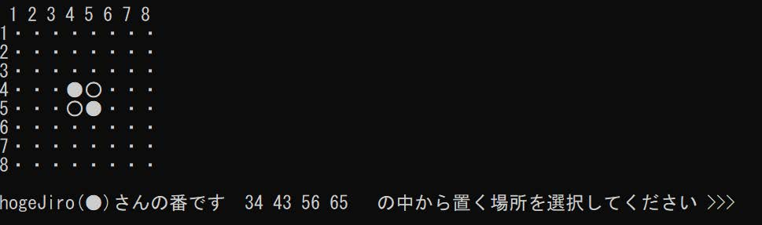
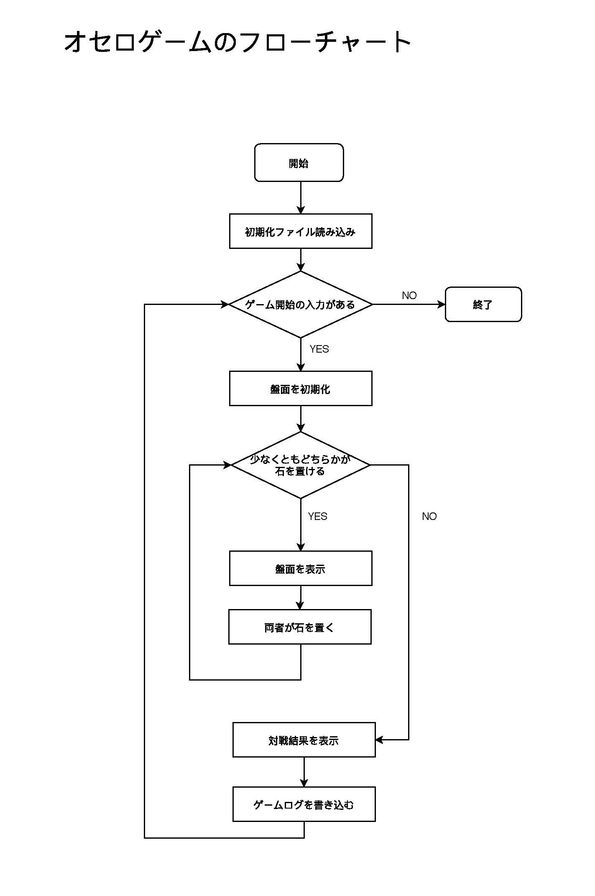

## 概要

コマンドラインでオセロゲームができるアプリ。対戦は人間同士である。

## 環境
- Visual Studio 2015
- Visual C++のWin32 コンソールアプリケーションとして実行

## 仕様

- ini ファイルでプレイヤの名前を設定できる
- アプリを起動すると先攻後攻を指定できる
- 手を入力するごとに盤面を表示する
- 各手における盤面は最終的にログとしてテキストファイルに保存される

## 使い方

- 起動前にini ファイルにプレイヤ名を書き込んでおく
- 起動すると先攻、後攻が表示されるのでこのままゲームを開始するか先後逆にして開始するかを選択する
- 8×8 のマスの中で石を置きたい場所を入力する.（例）6 行4 列のマスに置きたい場合、64 と入力する

## ソースファイル構成

- c15.cpp : オセロゲームのメインプログラム
- player.cpp : プレイヤに関する関数を集めたプログラム
- player.h : プレイヤに関する関数を宣言したヘッダファイル
- board.cpp : 盤面に関する関数を集めたプログラム
- board.h : 盤面に関する関数を宣言したヘッダファイル
- Setting.cpp : 初期化ファイルを利用するための関数を集めたプログラム
- Setting.h : 初期化ファイルを利用するための関数を宣言したヘッダファイル

## 工夫点

- 石を置く場所の選択を促す際、下図のように置ける場所を表示するようにした。こうすることで入力間違いを防ぐことが出来る。

- 対局のログファイルを残すことで、直近に行われたゲームを再現することが出来るようにした。
- 石を置く場所を文字列として扱うのではなく、11~88 のint 型の数で扱うことで柔軟な処理ができるようにした。
- どちらが黒白どちらの石なのかを一目見て分かるように、名前の後に（●）,（○）をつけた。

## 改良の余地がある点

- 人間同士の対局しかできないので面白味がない。オセロの手を考えるアルゴリズムを導入してCPU と対戦できるようにすればもっと面白いアプリになるだろう。
- 直感的に石の置き場所を選択しづらい。例えば列番号を「A,B,C・・・」のようにすれば「A6」のように入力できる。また、「6A」と入力しても正常に受け付けるとより便利になるかもしれない。

## フローチャート

